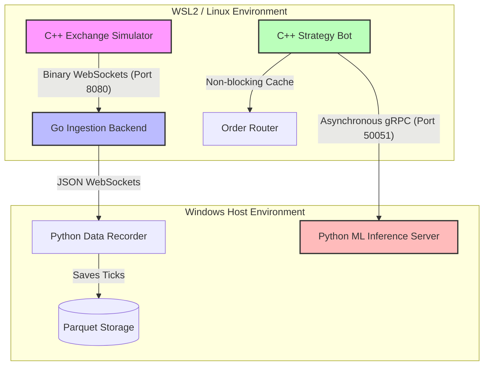

# High-Frequency Trading (HFT) Polyglot Pipeline & ML Platform

This guide provides an in-depth breakdown of the architecture, components, data flows, and machine learning models of this High-Frequency Trading (HFT) platform.

---

## 1. Introduction

The goal of this platform is to simulate a live financial exchange, ingest and validate high-frequency market updates (ticks/trades) at sub-millisecond speeds, engineer microstructural features, train machine learning models, and serve low-latency trading predictions.

It uses a polyglot architecture to leverage the strengths of each language:
* **C++** (WSL/Linux): Extreme speed for the matching engine and execution core.
* **Go** (Windows Host/Linux): Safe concurrency and high-throughput network routing.
* **Python** (Windows Host/Linux): Numerical computation, machine learning, and data serialization.

---

## 2. System Architecture & Execution Flow

The system runs as an integrated data loop across the WSL/Linux and Windows host borders:

---

## 3. Core C++ Design Concepts (`core-cpp/`)

The C++ Core is optimized for **ultra-low-latency** execution, employing standard industry patterns to keep processing times under a microsecond:

### ⚡ 3.1 Cache Line Alignment & Data Structure Layout
* **No False Sharing**: Core structures like `Order`, `Trade`, and `ExecutionReport` are annotated with `alignas(64)`. This aligns them to the CPU's L1 cache line size, preventing cache invalidation lines from bouncing between CPU cores.
* **Compact Layout**: Structs are packed and padded with exact offsets (e.g. `uint8_t _pad[14]`) to keep their sizes exactly at 64 bytes.

### ⏱️ 3.2 Lock-Free Ring Buffers & Memory Pools
* **No Dynamic Memory Allocation**: Standard C++ heap allocation (`new`/`malloc`) is banned from the critical hot path. 
* **Custom Memory Pools (`memory/`)**: Objects are pre-allocated at startup inside a block allocator pool. 
* **Lock-Free SPSC Queues (`queue/`)**: High-performance Single-Producer Single-Consumer ring buffers are used to pass messages between execution threads without thread locks or operating system context switches.

### 🚀 3.3 Asynchronous gRPC Client (Prediction Client)
* **Non-Blocking Strategy Loop**: Strategy engines cannot afford to block while waiting for a Python gRPC network response.
* **Thread Offloading**: The C++ Strategy Bot offloads gRPC calls (`Predict`) to a dedicated background execution thread. 
* **Shared Prediction Cache**: The background thread updates a thread-safe prediction cache. The C++ strategy loop reads from this cache instantly ($O(1)$) on every tick, ensuring it always executes trades using the latest prediction without ever blocking.

---

## 4. Deep Dive into Component Roles

### 3.1 C++ Exchange Simulator (`exchange-sim/`)
The exchange simulator acts as the primary source of truth for the entire pipeline, replicating real-world market operations.

* **Limit Order Book (LOB)**: Maintains a price-time priority order book for trading symbols. It supports `limit`, `market`, `IOC` (Immediate-or-Cancel), and `FOK` (Fill-or-Kill) order types.
* **Synthetic Participants**:
  * **Market Makers**: Continuously inject buy and sell orders around a moving mid-price to supply liquidity, creating realistic order book depth.
  * **Noise Traders**: Periodically submit market orders to cross the book, trigger matches (trades), and shift the bid-ask spread.
* **Data Broadcast**: Every order insertion, cancel, or trade execution triggers a state update. The top-of-book levels (best bid/ask prices and sizes, last trade price, and cumulative session volume) are packaged into packed binary packets and sent over a WebSocket connection (port `8080`).

---

### 3.2 Go Ingestion Backend (`backend-go/`)
The Go backend serves as the central data hub and routing coordinator of the system.

* **Binary Ingestion**: Subscribes to the C++ simulator's WebSocket feed. It decodes the incoming binary stream directly into memory-aligned structs, minimizing overhead.
* **Validation Engine**: Performs strict sanity checks on incoming ticks:
  * Ensures bids do not cross asks (detects crossed-book anomalies).
  * Validates that price and size values are strictly positive.
  * Flags missing sequence numbers to track network drops.
* **Parquet Buffer Management**: Ticks are accumulated in thread-safe memory buffers. When the buffer reaches 10,000 ticks or every 5 seconds, a background worker flushes them to disk as gzip-compressed Parquet files in `data/ticks/`.
* **Streaming Server**: Acts as a gateway by hosting a public WebSocket endpoint (`ws://localhost:8081/ws/market-data`), broadcasting validated JSON ticks to downstream applications.

---

### 3.3 Python ML Pipeline (`ml/`)
The ML pipeline handles the statistical, model-training, and inference phases of the trading cycle.

#### A. Data Gathering & Recording (`ml/data_gathering/`)
* Runs a data recorder that subscribes to the Go server's WebSocket.
* Validates sequence sequence numbers. If a gap is detected, it marks `seq_gap = True` for subsequent frames.
* Saves data to Parquet files in `ml/data/raw/` for feature engineering.

#### B. Feature Engineering (`ml/feature_engineering/`)
Computes high-frequency microstructural metrics from raw ticks:
* **Bid-Ask Spread**: $\text{Ask} - \text{Bid}$
* **Order Book Imbalance (OBI)**: Measures the supply-demand imbalance:
  $$\text{OBI} = \frac{\text{Bid Size} - \text{Ask Size}}{\text{Bid Size} + \text{Ask Size}}$$
* **Microprice**: A size-weighted mid-price that indicates short-term direction:
  $$\text{Microprice} = \frac{\text{Bid} \times \text{Ask Size} + \text{Ask} \times \text{Bid Size}}{\text{Bid Size} + \text{Ask Size}}$$
* **EWMA Metrics**: Exponentially Weighted Moving Averages track trend velocity.

#### C. Walk-Forward XGBoost Model Training (`ml/training/`)
* Loads historical Parquet logs.
* Labels the data based on whether the midprice moves up or down over a future prediction window.
* Uses **TimeSeriesSplit** (walk-forward validation) to train an XGBoost classifier. This ensures the model is never trained on future data, avoiding look-ahead bias.
* Exports the trained model and preprocessing pipeline as `.pkl` artifacts.

#### D. gRPC Inference Server (`ml/inference/`)
* Runs a high-performance gRPC server on port `50051`.
* Receives raw tick details from the C++ Strategy Bot, updates its running streaming feature state (EWMA and OBI), queries the XGBoost model, and returns a prediction containing a buy probability and direction.

---

## 4. Multi-Platform Execution Cycle (`Makefile`)

The system's build and run processes are consolidated into a cross-platform `Makefile` and helper shell scripts that automatically adapt to **Windows**, **WSL2**, and **Native Linux**:

* **`make build-cpp`**:
  * *Linux/WSL*: Compiles the C++ exchange simulator natively.
  * *Windows*: Instructs WSL to compile the Linux simulator binaries.
* **`make build-go`**:
  * *WSL*: Cross-compiles a Windows executable (`server.exe`) for hybrid execution.
  * *Native Linux*: Builds a native Linux binary (`server`).
  * *Windows*: Builds a native Windows executable (`server.exe`).
* **`make run`**: Invokes `scripts/run_local.sh` to run the ML Server, Go Server, Data Recorder, and C++ Exchange Simulator concurrently.
* **`make stop`**: Invokes `scripts/stop_local.sh` to terminate all running platform tasks cleanly.

---

## 5. Storage Schema & Serialization

The system stores market data using the Parquet format to ensure high compression ratios and fast column-oriented querying.

### Tick Parquet Schema
| Column | Parquet Type | Description |
| :--- | :--- | :--- |
| `timestamp_ns` | `INT64` | Nanosecond epoch timestamp from the exchange clock. |
| `symbol` | `BYTE_ARRAY` | Asset identifier (e.g. `AAPL`). |
| `bid` | `DOUBLE` | Best bid price. |
| `ask` | `DOUBLE` | Best ask price. |
| `bid_sz` | `DOUBLE` | Total available buy quantity at the best bid. |
| `ask_sz` | `DOUBLE` | Total available sell quantity at the best ask. |
| `last_price` | `DOUBLE` | Last traded price on the exchange. |
| `volume` | `DOUBLE` | Cumulative volume traded. |
| `sequence` | `INT64` | Monotonically increasing sequence number. |
| `seq_gap` | `BOOLEAN` | Indicated if a network packet drop occurred before this tick. |

> [!IMPORTANT]
> **Sequence Gaps & Masking**: If a sequence gap is detected (`seq_gap = True`), the ML pipeline automatically masks this tick during training. This prevents training on corrupted features where the mid-price appears to make an artificial "jump".
