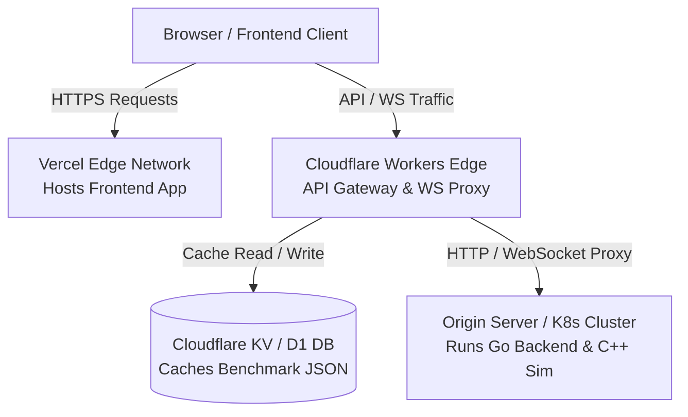

# Cloud Deployment Plan — Vercel & Cloudflare Workers

This document details the deployment strategy for hosting the **React + Vite Frontend** on **Vercel** and routing all API/WebSocket traffic through a serverless **Cloudflare Workers API Gateway**.

---

## 1. High-Level Architecture



### Component Roles:
1. **Frontend (Vercel)**: Hosts the single-page application (SPA) on a global CDN. Build outputs from `frontend/` are deployed automatically on git push.
2. **API Gateway (Cloudflare Workers)**: Operates at the edge, offering sub-millisecond execution times. It handles CORS, rate-limiting, and routes/proxies traffic to the origin.
3. **Storage/Cache (Cloudflare KV / D1)**: Stores static latency benchmark results (`core-cpp/results/`) and system metrics directly at the edge, shielding the origin server from heavy read traffic.
4. **Origin (Kubernetes / VM)**: Runs the persistent Go ingestion server and the C++ exchange simulator.

---

## 2. Frontend Deployment (Vercel)

The React frontend (configured under [frontend](../../frontend/)) is deployed as a static web application:

### Configuration Settings:
* **Framework Preset**: `Vite` (or `Other` for custom builds).
* **Root Directory**: `frontend`
* **Build Command**: `npm run build`
* **Output Directory**: `dist`

### Environment Variables:
Configure the following env variables in the Vercel Dashboard under **Project Settings**:
* `VITE_API_BASE_URL`: The custom routing address of your Cloudflare Worker (e.g. `https://api.hft-gateway.workers.dev`).
* `VITE_WS_URL`: The WebSocket address pointing to the Cloudflare Worker WS proxy (e.g. `wss://api.hft-gateway.workers.dev/ws/market-data`).

---

## 3. API Gateway & Routing (Cloudflare Workers)

Cloudflare Workers serve as the edge controller. The worker script performs three critical functions:

### A. Route Mapping & Forwarding
The Worker intercepts requests at `api.yourdomain.com/*` and routes them:
* **`GET /health`**: Queries the origin Go backend health check or reads from Cloudflare KV.
* **`GET /api/benchmarks`**: Fetches cached benchmark metrics from Cloudflare KV (updated periodically by a worker cron trigger or push webhook from the origin).
* **`GET /ws/*`**: Upgrades HTTP connections to WebSockets and tunnels packets to the origin Go WebSocket server.

### B. WebSocket Proxying (Edge Tunneling)
Since the Go backend processes WebSocket traffic, the Worker acts as a reverse proxy:
1. The client establishes a handshake with the Worker.
2. The Worker establishes a corresponding backend WebSocket connection to the origin Go server (e.g. `ws://origin.ip:8081/ws/market-data`).
3. The Worker pipes messages bidirectionally between the client and the backend socket using Cloudflare's `WebSocketPair` API.

### C. Global CORS Management
The Worker acts as a unified CORS middleware, injecting the following headers into all edge responses:
* `Access-Control-Allow-Origin: *` (or specific Vercel deployment domain)
* `Access-Control-Allow-Methods: GET, POST, OPTIONS`
* `Access-Control-Allow-Headers: Content-Type, Authorization`

---

## 4. Origin Server Integration (Go Backend)

To allow Cloudflare Workers to communicate with the Go backend:
* **Origin Firewall**: Open TCP ports `8081` (Go WebSocket Gateway) and `9090` (gRPC) only to Cloudflare's public IP ranges (listed at `https://www.cloudflare.com/ips/`) for security.
* **SSL/TLS**: Ensure the Go backend or origin load balancer terminates SSL correctly, allowing the Worker to connect securely via `https://` and `wss://`.

---

## 5. Deployment Step Summary

### For the Vercel Frontend:
1. Push changes from the `frontend/` directory to your Git repository (GitHub/GitLab).
2. Connect the repository in Vercel, set the build parameters, and deploy.

### For the Cloudflare Worker:
1. Install Wrangler CLI: `npm install -g wrangler`.
2. Configure Wrangler settings (`wrangler.toml`) to specify the Worker name, KV namespace bindings, and production routing triggers.
3. Deploy the worker script to Cloudflare's global edge network:
   ```bash
   wrangler deploy
   ```
