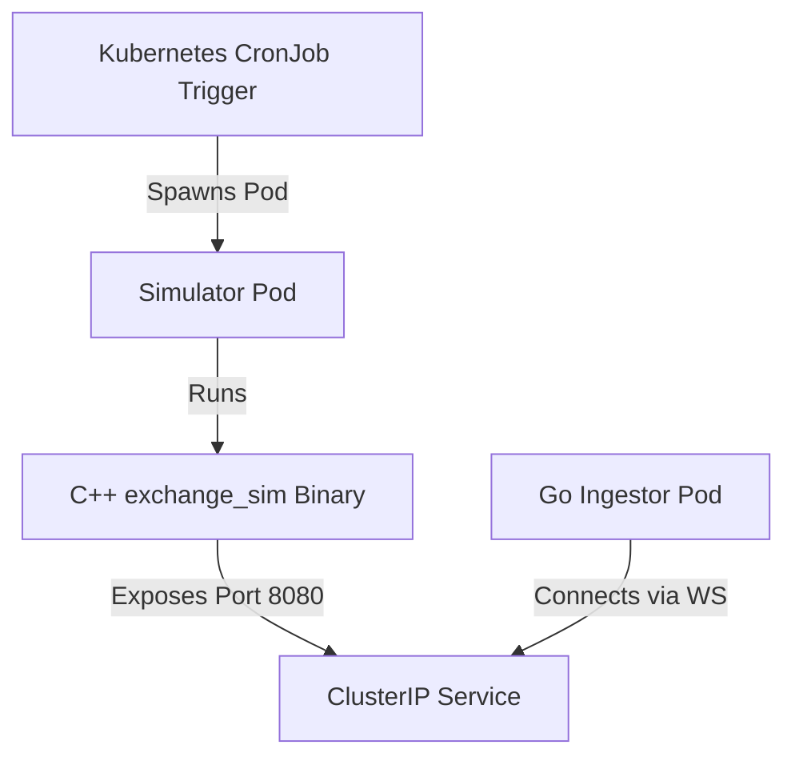

# C++ Exchange Simulator — Kubernetes CronJob Deployment Plan

This document outlines the architecture, setup steps, and configuration details for deploying the C++ Exchange Simulator as a **Kubernetes CronJob** in a production or staging cluster.

---

## 1. High-Level Architecture



* **Simulator Lifecycle**: The simulator runs as a short-lived container task. Once the specified duration is reached (e.g. `--duration 300`), the C++ process exits with code `0`, and Kubernetes marks the job as `Completed`.
* **Go Backend Discovery**: The Go backend accesses the simulator via a headless Service DNS name (e.g. `ws://hft-exchange-sim:8080/ws`).

---

## 2. Containerization Strategy

To deploy the simulator, we construct a Docker image for [exchange-sim](../../exchange-sim/) using a **multi-stage build** to optimize performance, footprint, and security.

### Stage 1: Build Environment (g++ & CMake)
* **Base Image**: `ubuntu:22.04` or `debian:12-slim` with development tools.
* **Dependencies**: Install `cmake`, `make`, `g++`, and any required networking/SSL header packages.
* **Action**: Copy the C++ simulator source and build it in `Release` mode with optimizations:
  ```bash
  cmake -S . -B build -DCMAKE_BUILD_TYPE=Release && cmake --build build
  ```

### Stage 2: Runtime Container
* **Base Image**: A minimal `debian:12-slim` image to reduce size and surface vulnerabilities.
* **Action**: Copy only the compiled `exchange_sim` binary from Stage 1. 
* **Entrypoint**: Define the executable as the container entrypoint, allowing configuration overrides via environment variables.

---

## 3. CronJob Configuration Plan

The resource specification ([simulation-cronjob.yaml](./simulation-cronjob.yaml)) should be configured with the following parameters:

### A. Lifecycle & Execution Policies
| Field | Value | Rationale |
| :--- | :--- | :--- |
| `schedule` | `"*/30 * * * *"` | Triggers the simulation at standard intervals (e.g., every 30 minutes). |
| `concurrencyPolicy` | `Forbid` | **Critical.** Prevents a new simulation pod from starting if a previous run is still active. This avoids port collisions on port `8080`. |
| `startingDeadlineSeconds` | `60` | Allows a startup window of 60 seconds if the cluster scheduler is congested. |
| `activeDeadlineSeconds` | `360` | A timeout buffer (e.g. 6 minutes for a 5-minute run) to force-kill stuck processes. |
| `restartPolicy` | `OnFailure` | Restarts the pod if it crashes unexpectedly, but prevents infinite boot loops on configuration errors. |
| `backoffLimit` | `2` | Limits job retries before declaring a failure. |

### B. CPU & Memory Allocation (QoS)
To guarantee low latency and prevent scheduling jitter:
* **Resource Limits & Requests**: Configure `limits` exactly equal to `requests` for both CPU and memory. This places the container in the **Guaranteed QoS Class**, protecting it from resource eviction.
* **Latency Profile**: Request at least `1 Full Core` (e.g., `1000m` CPU) to minimize context switching overhead on the host OS scheduler.

### C. Configurable Environment Variables
The container should read its runtime arguments from environment variables mapped to a central Kubernetes `ConfigMap`:
* `SIM_MODE`: Mode selector (`synth` or `replay`).
* `SIM_DURATION`: Duration of simulation run in seconds.
* `SIM_SYMBOL`: Target trading symbol ID (e.g. `0` for AAPL in [dev.yaml](../../configs/dev.yaml)).
* `SIM_SPREAD`: Market maker half-spread in price ticks.
* `SIM_NOISE_US`: Interval for noise trader orders (microseconds).
* `SIM_WS_PORT`: WebSocket publisher port (default `8080`).

---

## 4. Service Discovery & Networking

To allow the Go Ingestion Backend to subscribe to the simulator's binary WebSocket feed:
1. **Headless Service**: Create a Kubernetes `Service` with `clusterIP: None` targeting the simulator pods.
2. **Access URL**: The Go backend will connect using the internal DNS name:
   `ws://hft-exchange-sim-svc.default.svc.cluster.local:8080`

---

## 5. Logging and Observability

* **Clean Logging**: The simulator writes tick updates directly to `stdout`. These logs are scraped automatically by daemonsets (e.g., Promtail, FluentBit) and forwarded to central logging systems (e.g., Loki, Elasticsearch).
* **Metrics**: Monitor exit codes using Prometheus Kube-State-Metrics. Alerting rules should trigger if a job fails (`kube_job_status_failed > 0`).
* **History Limits**:
  * `successfulJobsHistoryLimit: 3` (retains metadata of the last 3 successful runs).
  * `failedJobsHistoryLimit: 5` (retains metadata of the last 5 failed runs for post-mortem debugging).

