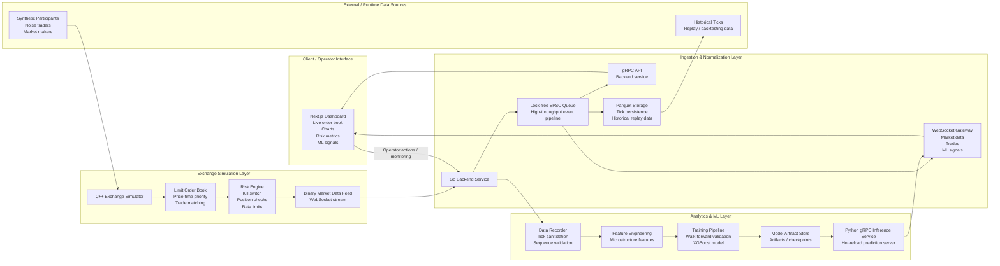

# Quant-Trade


# QuantTrade HFT Platform

QuantTrade is a full-stack, low-latency trading simulation platform designed to model a real market microstructure pipeline from exchange simulation and data ingestion to machine learning inference and a live monitoring dashboard. The project combines C++, Go, Python, and Next.js to demonstrate how a modern trading system can be structured across multiple layers while keeping performance, reliability, and observability in focus.

This repository is intended as both an engineering showcase and a practical reference for building distributed, event-driven systems in financial technology.

## Overview

The system simulates a realistic trading environment in which:

- the exchange engine produces market data and trades,
- the ingestion service validates and forwards streaming market events,
- the analytics and ML pipeline performs feature generation and prediction,
- the frontend exposes operational dashboards and live market views.

The platform is organized as a polyglot system, where each component is implemented in the language best suited to its job:

- C++ for low-latency matching and risk evaluation,
- Go for ingestion, orchestration, and service APIs,
- Python for ML workflows and inference,
- Next.js for interactive visualization and operator dashboards.

## Key Capabilities

- Full limit-order-book simulation with price-time priority matching
- Synthetic market participant generation for realistic order flow
- Real-time market data streaming over WebSocket
- High-throughput ingestion pipeline with robust failure handling
- Pre-trade risk evaluation and loss controls
- Feature extraction for short-horizon predictive models
- XGBoost-based signal generation for price direction prediction
- Hot-reload inference for ML model updates without restarting the service
- Live UI with order book, trade stream, and model signal visualization

## Architecture

The system is designed as a multi-layer streaming architecture where each component has a distinct responsibility. The exchange engine handles real-time order generation and matching, the Go ingestion layer normalizes and distributes market events, the Python ML stack analyzes microstructure signals, and the dashboard exposes operational status and market views in near real time.



# System-Design


### Detailed component responsibilities

1. Exchange layer
   - Maintains order book state and executes matching logic using price-time priority.
   - Produces synthetic market activity through noise traders and market makers.
   - Applies pre-trade risk controls before orders are accepted or executed.
   - Emits binary tick data and trade events for downstream processing.

2. Ingestion layer
   - Receives the raw stream from the exchange simulator.
   - Validates sequence continuity, gaps, and malformed events.
   - Pushes normalized data into a lock-free queue to avoid lock contention on the hot path.
   - Re-broadcasts market data to clients and stores time-series data for replay and model training.

3. Analytics and ML layer
   - Converts tick streams into structured features such as spread, imbalance, volatility, and return metrics.
   - Trains models using walk-forward validation to avoid look-ahead leakage.
   - Persists model artifacts for reuse and dynamic loading.
   - Serves predictions through a Python gRPC service with hot-reload support.

4. Frontend layer
   - Displays live price action, order book depth, trade execution streams, and signal overlays.
   - Connects to real-time WebSocket feeds and operational APIs.
   - Gives operators a visual view of system behavior and risk state.

### Data flow summary

1. The exchange simulator maintains the order book and emits live market events.
2. The Go backend ingests the stream, validates it, and distributes normalized data to consumers.
3. The recorder and feature pipeline transform raw ticks into ML-ready inputs.
4. The training pipeline generates prediction models and stores them as artifacts.
5. The inference service loads those artifacts and publishes predictions back to the system.
6. The frontend displays the combined state of the market, predictions, and operational health.

## Technology Stack

| Layer | Technologies | Purpose |
| --- | --- | --- |
| Exchange engine | C++20, CMake | Matching engine, risk logic, order book state |
| Backend services | Go, gRPC, WebSocket | Streaming ingestion, API exposure, internal coordination |
| ML pipeline | Python, pandas, NumPy, scikit-learn, XGBoost | Feature engineering, model training, inference |
| Frontend | Next.js, TypeScript, Tailwind, Recharts | Real-time monitoring and trading dashboard |
| Deployment | Docker, Docker Compose, Kubernetes | Containerized service deployment and runtime orchestration |
| Data exchange | Protocol Buffers | Typed service contracts between components |

## Machine Learning Components

The ML pipeline is designed to predict short-term price direction using financial microstructure features such as:

- bid-ask spread and microprice,
- order book imbalance,
- rolling volatility,
- log returns over multiple horizons,
- exponentially weighted moving averages,
- feature sets derived from tick-level market activity.

The model is trained using walk-forward validation so that data leakage from future periods is avoided. Inference is served through a gRPC endpoint and is configured to hot-reload updated model artifacts without requiring a full service restart.

## Repository Structure

```text
Quant_Trade/
├── backend-go/            # Go ingestion layer and service APIs
├── core-cpp/              # C++ risk and market-structure primitives
├── exchange-sim/          # Exchange simulator and synthetic market generation
├── frontend/              # Next.js dashboard and UI components
├── ml/                    # Python ML pipeline, training, and inference
├── proto/                 # Protocol Buffer definitions
├── configs/               # Environment and runtime configuration files
├── docs/                  # Architecture and deployment documentation
├── scripts/               # Local build and deployment automation
├── artifacts/             # Trained model outputs and runtime artifacts
├── docker-compose.yml     # Multi-service local development stack
├── Makefile               # Local build orchestration
├── README.md              # Project overview and developer entry point
└── LICENSE                # Project licensing
```

## Prerequisites

To run the project locally, ensure that the following tools are available:

- Docker and Docker Compose
- Go 1.23 or later
- Python 3.10+
- Node.js 18+ and npm or pnpm
- CMake and a C++ toolchain
- Optional: Minikube for cluster-style local deployment testing

## Quick Start

### Option 1: Run with Docker Compose

```bash
git clone <repository-url>
cd Quant_Trade

docker compose up --build -d

docker compose logs -f
```

Once the services are running, open the frontend in the browser:

```text
http://localhost:3000
```

### Option 2: Run locally with Make

```bash
cd Quant_Trade
make all
make run
```

To stop the local services:

```bash
make stop
```

### Option 3: Frontend-only development

```bash
cd Quant_Trade/frontend
npm install
npm run dev
```

## Service Endpoints

| Service | Endpoint | Notes |
| --- | --- | --- |
| Frontend dashboard | http://localhost:3000 | Trading and monitoring UI |
| Exchange simulator websocket | ws://localhost:8080 | Raw simulator feed |
| Market data websocket | ws://localhost:8081/ws/market-data | Normalized tick stream |
| Trade websocket | ws://localhost:8081/ws/trades | Executed trade stream |
| ML prediction websocket | ws://localhost:8081/ws/ml-predictions | Prediction stream |
| gRPC backend | localhost:9090 | Backend service traffic |
| gRPC ML service | localhost:50051 | Prediction API |

## Local Development Notes

The project is intentionally structured as a multi-service system. While each service has its own runtime dependencies, they are designed to work together through shared configuration and protocol definitions.

In practice, development usually follows this process:

1. start the exchange simulator,
2. bring up the Go ingestion backend,
3. launch the Python ML service,
4. run the frontend dashboard,
5. monitor output and metrics across services.

For local debugging, it is recommended to run each component in a separate terminal so that logs and process-level failures are easier to isolate.

## Documentation

Additional project documentation is available here:

- [docs/architecture.md](docs/architecture.md)
- [docs/deployment.md](docs/deployment.md)
- [docs/api.md](docs/api.md)
- [deployment/cloud_deployment.md](deployment/cloud_deployment.md)

## Deployment Considerations

The system supports both local containerized deployment and Kubernetes-oriented deployment patterns. The project includes Docker assets for service packaging and deployment manifests for cluster-style environments. The configuration layer enables environment-specific setup for development, testing, and production-like runs.

## Engineering Highlights

- Lock-free ingestion pipeline to reduce contention on the hot path
- Circuit-breaker style reconnect handling for resilient streams
- Pre-trade risk logic optimized for fast evaluation
- Tick-sequence validation to detect discontinuities and data corruption
- Model artifact hot-reloading for continuous inference updates

## License

This project is provided for educational and portfolio use. See the project license for details and terms of use.

