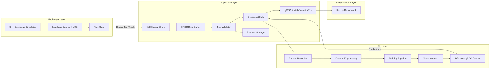
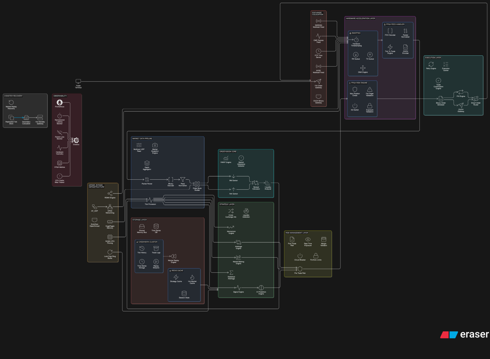
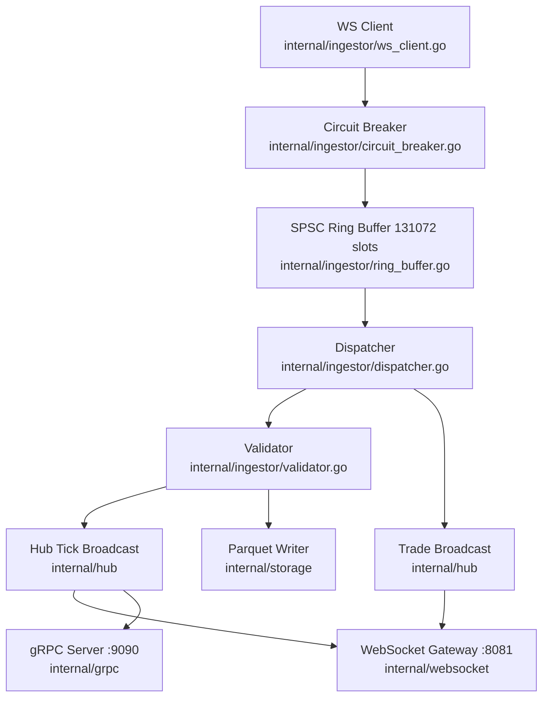
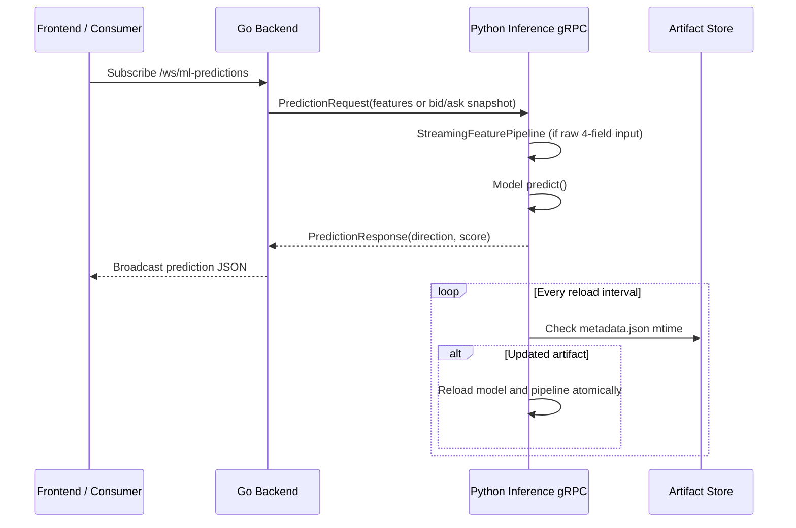
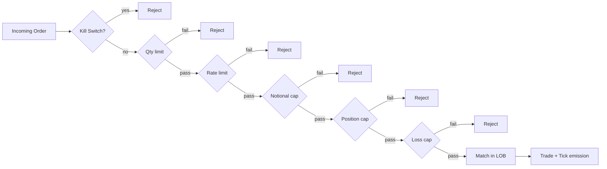
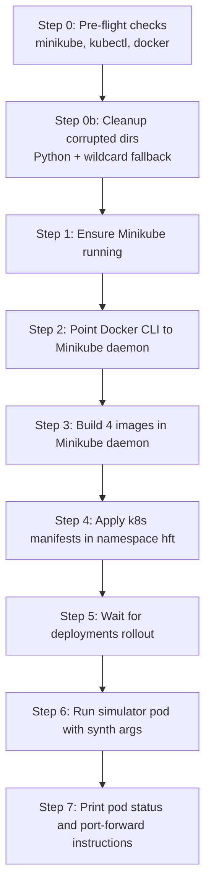

# QuantTrade HFT Platform

## Purpose

This document is the engineering README for internal development and operations. It describes the current architecture, low-level design, runtime flow, and the Minikube-based Kubernetes execution model used by this project.

## Scope

- High-Level Design (HLD) for the end-to-end platform
- Low-Level Design (LLD) for core service internals and data movement
- Deployment model implemented in `scripts/deploy_local.bat`
- Operational notes for local Kubernetes execution with Minikube

## 1. System Summary

QuantTrade is a polyglot, event-driven high-frequency trading simulation platform with four runtime tiers:

- C++ exchange simulation and matching engine
- Go ingestion, validation, fan-out, and persistence layer
- Python ML feature, training, and inference pipeline
- Next.js frontend dashboard for real-time visualization

Primary objectives:

- deterministic market simulation and order matching
- low-latency ingestion and distribution
- model-assisted signal generation
- reproducible local deployment on Kubernetes

## 2. High-Level Design (HLD)

### 2.1 Logical architecture



### 2.2 Runtime endpoints

| Component | Protocol | Endpoint |
| --- | --- | --- |
| Exchange simulator | WebSocket (binary) | `ws://exchange-sim:8080/ws/market-data` |
| Go gateway (ticks) | WebSocket (JSON) | `ws://hft-backend:8081/ws/market-data` |
| Go gateway (trades) | WebSocket (JSON) | `ws://hft-backend:8081/ws/trades` |
| Go gateway (predictions) | WebSocket (JSON) | `ws://hft-backend:8081/ws/ml-predictions` |
| Go backend API | gRPC | `hft-backend:9090` |
| ML inference | gRPC | `hft-ml-predictor:50051` |
| Frontend | HTTP | `http://hft-frontend:3000` |

### 2.3 Reference architecture diagram

The diagram below is the detailed visual reference used by the team for the complete platform topology.



## 3. Low-Level Design (LLD)

### 3.1 Ingestion internals (Go)



### 3.2 ML inference request path



### 3.3 Exchange and risk flow



## 4. Kubernetes / Minikube Deployment Model (Implemented)

This project uses a script-driven local Kubernetes deployment through Minikube. The canonical implementation is in `Quant_Trade/scripts/deploy_local.bat`.

### 4.1 What the script actually does



### 4.2 Images built by the script

- `quant_trade/hft-backend:latest`
- `quant_trade/ml-predictor:latest`
- `quant_trade/hft-frontend:latest`
- `quant_trade/exchange-sim:latest`

### 4.3 Manifest application order

1. `deployment/k8s/platform-services.yaml`
2. `deployment/k8s/simulation-cronjob.yaml`

Namespace enforced by script: `hft`.

### 4.4 Simulator startup in cluster

The script runs a pod named `hft-simulator-test` with image pull policy `Never` and command:

- executable: `/app/exchange-sim/build/exchange_sim`
- args: `--synth --duration 82800 --symbol 0 --spread 2 --noise-interval-us 100000 --ws-port 8080`

### 4.5 Local access after deployment

Open two terminals and run:

```bash
kubectl port-forward svc/hft-frontend-svc -n hft 3000:3000
kubectl port-forward svc/hft-backend-svc -n hft 8081:8081
```

Then access:

```text
http://localhost:3000/dashboard
```

## 5. Project Analysis

### 5.1 Why this architecture fits the workload

- C++ handles deterministic matching and tight latency paths.
- Go isolates I/O concurrency, ingestion resilience, and fan-out concerns.
- Python accelerates ML iteration without coupling inference to exchange code.
- Next.js provides operational visibility and data presentation.

This separation improves maintainability while preserving low-latency behavior on critical paths.

### 5.2 Performance-critical paths

- Exchange matching and risk checks run in C++ hot loops.
- Ingestion uses a lock-free SPSC queue to avoid mutex contention.
- Dispatcher decouples producer and consumer rates.
- ML inference remains off the exchange hot path via gRPC.

### 5.3 Reliability controls

- Circuit breaker around exchange feed reconnect in Go.
- Sequence-gap detection in validation and recorder workflows.
- Bounded buffers and periodic Parquet flushing.
- Model hot-reload with atomic swap in Python inference layer.

### 5.4 Data contracts

- Binary Tick and Binary Trade from simulator to backend.
- JSON WebSocket fan-out from backend to dashboard and recorder.
- gRPC protobuf contracts for backend and prediction services.

## 6. Repository Map (Team View)

```text
Quant_Trade/
├── Quant_Trade/
│   ├── backend-go/
│   ├── core-cpp/
│   ├── exchange-sim/
│   ├── ml/
│   ├── frontend/
│   ├── proto/
│   ├── configs/
│   ├── deployment/k8s/
│   ├── scripts/deploy_local.bat
│   ├── docker-compose.yml
│   └── README.md
└── README.md  (this team-facing engineering overview)
```

## 7. Developer Operations

### 7.1 Preferred local k8s path

Run from `Quant_Trade/Quant_Trade`:

```bash
scripts\deploy_local.bat
```

### 7.2 Rollout checks

```bash
kubectl get pods -n hft
kubectl rollout status deployment/hft-backend-deploy -n hft --timeout=120s
kubectl rollout status deployment/hft-ml-predictor-deploy -n hft --timeout=120s
kubectl rollout status deployment/hft-frontend-deploy -n hft --timeout=120s
```

### 7.3 Common failure points

- Docker context not switched to Minikube daemon before image builds.
- Missing Minikube prerequisites (`minikube`, `kubectl`, `docker`).
- Windows path and context transfer issues during `docker build`.
- Insufficient Docker disk space for C++ image compilation.

## 8. Related Detailed Reference

For deeper internal details, use `DEVELOPER_README (1).md` as the full technical reference for component internals, schema formats, and benchmark notes.

## 9. License

This project is intended for educational and portfolio use.
