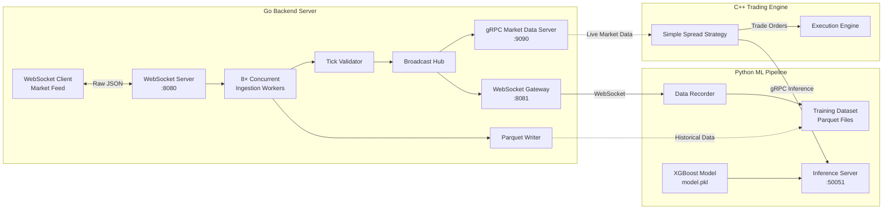

```mermaid
flowchart LR

%% ==============================
%% GO BACKEND
%% ==============================
subgraph GO["Go Backend Server"]
    direction TB

    WSC["WebSocket Client<br/>Market Feed"]
    WSP["WebSocket Server<br/>:8080"]

    ING["8× Concurrent<br/>Ingestion Workers"]
    VAL["Tick Validator"]
    HUB["Broadcast Hub"]

    PQ["Parquet Writer"]

    GW["WebSocket Gateway<br/>:8081"]
    GRPC["gRPC Market Data Server<br/>:9090"]

    WSC <-->|Raw JSON| WSP
    WSP --> ING
    ING --> VAL
    VAL --> HUB
    ING --> PQ

    HUB --> GW
    HUB --> GRPC
end

%% ==============================
%% PYTHON ML PIPELINE
%% ==============================
subgraph PY["Python ML Pipeline"]
    direction TB

    REC["Data Recorder"]
    PAR["Training Dataset<br/>Parquet Files"]

    INF["Inference Server<br/>:50051"]

    MODEL["XGBoost Model<br/>model.pkl"]

    GW -->|WebSocket| REC
    REC --> PAR

    MODEL --> INF
end

%% ==============================
%% C++ STRATEGY ENGINE
%% ==============================
subgraph CPP["C++ Trading Engine"]
    direction TB

    STRAT["Simple Spread Strategy"]
    EXEC["Execution Engine"]

    STRAT -->|gRPC Inference| INF
    STRAT -->|Trade Orders| EXEC
end

%% ==============================
%% DATA FLOW
%% ==============================

PQ -. Historical Data .-> PAR
GRPC -. Live Market Data .-> STRAT
```